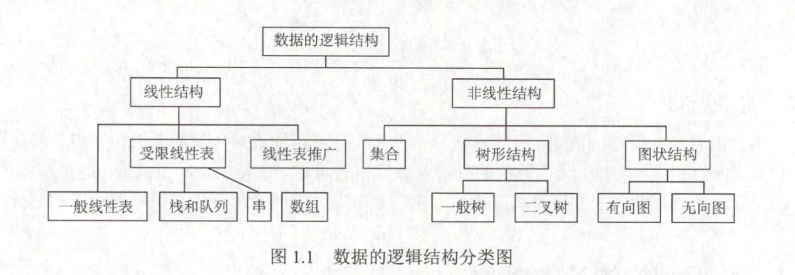

# 绪论

## 基本概念和术语

**数据** 信息的载体，描述客观事物属性的数、字符及所有能输入到计算机并被程序识别和处理的符号的集合，是程序加工的原料。

**数据元素** 数据的基本单位，由若干个数据项组成，**数据项**是构成其的不可分割的最小单位。

- 如一条学生记录为一个数据元素，由学号、姓名、性别等数据项组成。

**数据对象** 具有相同性质的数据元素的集合，是数据的子集。

**数据类型** 是一个值的集合和定义在该集合上的一组操作的总称。

* **原子类型** 其值不可再分的数据类型；
* **结构类型** 其值可在分解为若干成分的数据类型；
* **抽象数据类型** 抽象数据组织及与之相关的操作。

【理解】

- 数据元素 - 对象
- 数据项 - 属性（基本数据类型）

## 什么是数据结构

并无官方明确定义，可简述为相互之间存在一种或多种特定关系的数据元素的集合。数据元素在具体问题中并非孤立存在，其相互之间的关系称之为结构。数据结构包括三方面内容（即数据结构三要素）：

- 逻辑结构（决定算法的设计）；
- 存储结构（被算法的实现所依赖）；
- 数据的运算。


### 逻辑结构

元素之间的逻辑关系，从逻辑上描述数据，独立于计算机，与数据的存储无关。分为：



**线性结构** 元素间仅有一对一；

**非线性结构**

- **集合** 元素间同属一个集合；
- **树形结构** 元素间一对多；

- **图状/网状结构** 元素间多对多。

### 存储结构

指数据结构在计算机中的表示（又称映像），也称物理结构。包括数据元素的表示和关系的表示。依赖于计算机语言，主要的存储结构有：

- **顺序存储** 逻辑上相邻，物理上也相邻。**优点**：可实现随机存取（即根据一个元素所占空间计算出元素位置），每个元素占用最小的空间。**缺点**：只能使用相邻的一整块存储单元，故可能产生较多外部碎片；
- **链式存储** 逻辑上相邻，物理上不一定。**优点**：由指针表示元素间逻辑关系，不会产生碎片现象，充分利用所有存储单元。**缺点**：每个元素存储指针占用额外存储空间，且只能实现顺序存取；
- **索引存储** 存储元素信息的同时，建立附加索引表。表中每项称为**索引项**，其形式为 `(关键字,地址)` 。**优点**：检索速度快；缺点：附加的索引表额外占用存储空间，增加、删除数据需要修改索引表，花费较多时间；
- **散列存储** 根据元素关键字直接计算元素存储地址，也称哈希存储。**优点**：增加、删除、检索结点的操作都很快。**缺点**：若散列函数不好会导致元素存储单元冲突，解决冲突将会增加时间和空间开销。

### 数据的运算

包括运算的定义和实现。定义针对逻辑结构，指出运算的功能；实现针对存储结构，指出具体操作步骤。

## 	算法

### 什么是算法

简言之，算法就是解决问题的一种**方法、思想**。

**算法有简单复杂之分，也有高效低能之分**。衡量标准如下：

- 时间复杂度；
- 空间复杂度。

算法的 5 个重要特性 “**有确可输出**”

1. **有穷性** 算法执行有穷步并且每一步在有穷时间内完成；
2. **确定性** 每条指令由确切含义，相同输入只能得到相同结果；
3. **可行性** 可通过已实现的基本运算执行有限次来实现；
4. **输入** 有零个或多个输入；
5. **输出** 有一个或多个输出。

好算法的目标：“**正可见高低**”

1. **正确性** 正确求解问题
2. **可读性** 可读易理解
3. **健壮性** 非法输入时，能适当做出反应或进行处理
4. **高效率与低存储量需求** 执行时间与所需存储空间

### 算法的复杂度

衡量程序好坏的标准。简单来说，就是代码运行时间和程序的大小。

### 时间复杂度

渐进时间复杂度，简称时间复杂度，我们可以通过代码的基本操作执行次数来替代时间。

**频度** 语句在算法中被执行的次数称为语句的频度，算法中所有语句频度之和记为 $T(n)$，是问题规模 $n$ 的函数，时间复杂度即分析 $T(n)$ 的数量级；而函数 $f(n)$ 则是**算法中的基本运算**（最深层循环内的语句）的频度，它与 $T(n)$ 同数量级。

因此，常用算法中的基本运算频度 $f(n)$ 分析算法的时间复杂度，记为：

$$T(n) = O(f(n))$$

$O$ 表示 $T(n)$ 的数量级，即若存在函数 $f(n)$，使得当 $n$ 趋近于无穷大时，$\frac{T(n)}{f(n)}$ 的极限值为不等于零的常数，则称 $f(n)$ 是 $T(n)$ 的同数量级函数，也称**大 $O$ 表示法**。

大 $O$ 表示法保留结果的原则：

- 如果运行时间是常数量级，使用常数 1 表示；
- 只保留函数的最高阶项；
- 存在最高阶项，则省去最高阶项的系数。

时间复杂度分为最好/平均/最坏时间复杂度，一般都考虑最坏时间复杂度，保证算法运行时间不会比它更长。

加法法则 $O(max(f(n),g(n)))$

乘法法则 $O(f(n) * g(n))$

【技巧】渐进时间复杂度口诀：常对幂指阶（联想高数中极限趋向的快慢）

### 空间复杂度

记为 $S(n)$，定义为该算法所耗费的存储空间，是问题规模 $n$ 的函数，记为

$$S(n) = O(g(n))$$

**算法原地工作** 算法所需的辅助空间为常量，即 $O(1)$

### 时间复杂度的计算

1. 循环主体中的变量参与循环条件的判断

找主体语句执行次数和 $T(n)$ 成正比的循环变量，代入条件中进行计算

```c
// code1
int i = 1;
while(i<=n){
    i=i*2;
}
// code2
int y = 5;
while((y+1)*(y+1)<n){
    y=y+1;
}
```

code1 中 `i*2` 的次数就等于循环次数，与 T(n) 成正比

code2 中 `y+1` 看作一个整体，当前的 `y+1` 实际上是 `(y+1)+1`，令 y+1 = Y，故 Y/T(n) = k 成正比

2. 循环主体中的变量与循环条件无关
   1. 递归：公式递推
   2. 非递归：累次计数