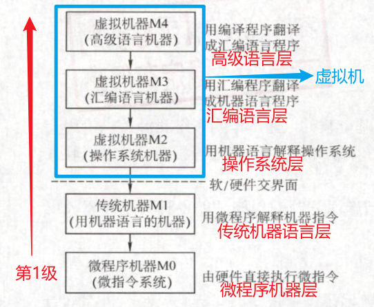
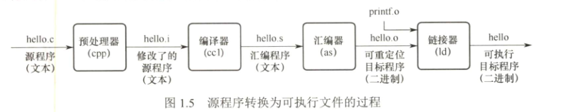

# 计算机系统概述

## 计算机系统层次结构

### 计算机系统的组成

#### 计算机硬件

1. 冯诺依曼基本思想：冯诺依曼机
   1. 工作方式：存储程序
   2. 硬件组成：运存控输出
   3. 指令和数据同等地位存储，形式无区别，但能被计算机区分
2. MAR（寻址，和 PC 等长）、MDR（和存储字长等长）逻辑属于主存，实际在 CPU 中

3. 运算器：ALU（核心）

4. 寄存器：ACC、MQ、X、IX、BR，前三必备

5. 控制器：PC、IR（存放当前指令）、CU

CPU = 运算器 + 控制器

主机 = CPU + 主存

其他硬件：外部设备

#### 计算机软件

系统软件和应用软件

语言级别

1. 机器语言

2. 汇编语言：汇编器

3. 高级语言：编译器、解释器

软件和硬件具有逻辑功能等价性

### 计算机系统层次结构

软件与硬件间的界面就是指令集体系结构（ISA），其定义了一台计算机可以执行的所有指令集合

### 计算机系统的工作原理

1. 存储程序的工作方式：将指令和数据送入主存，程序启动执行后无需人员干预，自动执行
2. 源程序到可执行文件的过程

### 指令执行过程的描述

(PC) 指 PC 中存放的内容

## 计算机性能指标

字长

数据通路宽度

主存容量：MAR（字数）× MDR（字长）

运算速度：

1. 吞吐量和响应时间
2. 主频和CPU时钟数
   1. 主频（CPU时钟频率）：单位 Hz，1Hz 即每秒 1 次
   2. 时钟周期（节拍脉冲）：主频的倒数，CPU中最小的时间单位，指令每个动作至少需要 1 个时钟周期
3. CPI
4. CPU执行时间： $\frac{CPU时钟周期数}{主频}=\frac{指令条数\times CPI}{主频}$
5. MIPS： $\frac{指令条数}{执行时间\times 10^6}=\frac{主频}{CPI\times 10^6}$
6. 浮点运算：M/G/T/P/E/Z FLOPS

文件大小：K M G T P Z 以 2 为底，后者为前者的 10 次幂

速率、频率：k小写做区分，其他不变，以 10 为底，后者为前者的 3 次幂

基准程序

专业术语：

1. 系列机
2. 兼容
3. 软件可移植性
4. 固件

